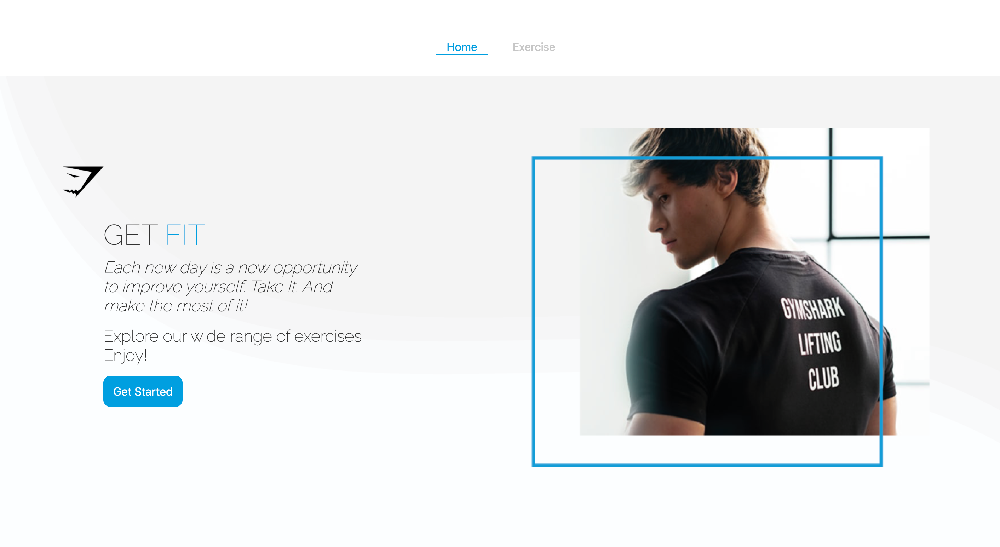
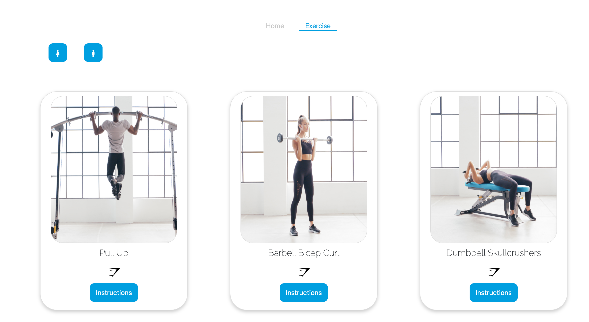
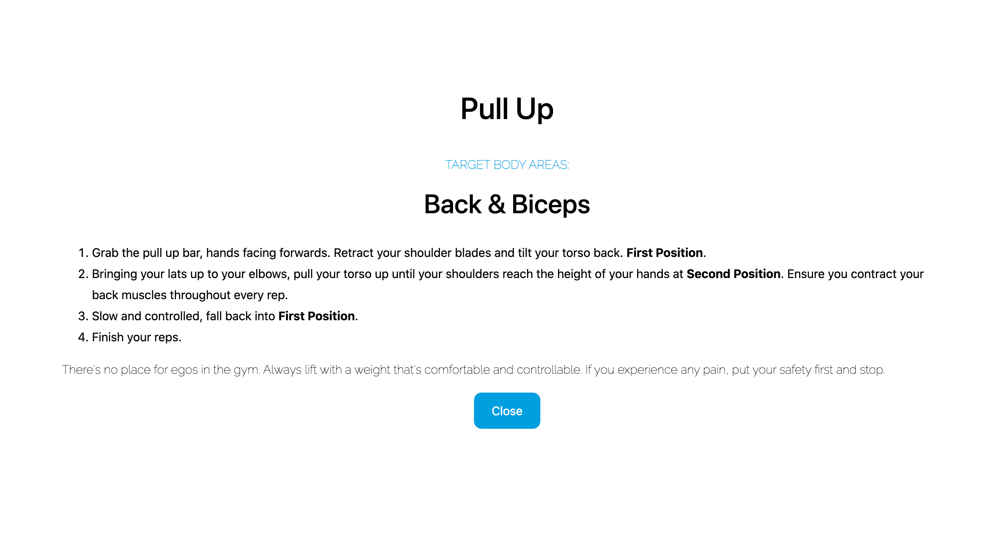

# Gymshark Technical Test || Fitness Guide

# Description

The aim of this exercise is to create a user interface using a javascript framework, here I used react. I was provided with an API with a list of exercises and their descriptions such as name, body areas targeted, images and instructions for each exercise. My goal was to present this information to the user appropriately.

# Key Detail

The key aspects of the app are:
1. Display the list of exercises
2. Display the image
3. Users should be able to toggle between genders and the image will change depending on which gener is selected
4. Selecting each exercise will then show information about this exercise.

# Link to Application

[View application](https://fitness-guide.herokuapp.com)

